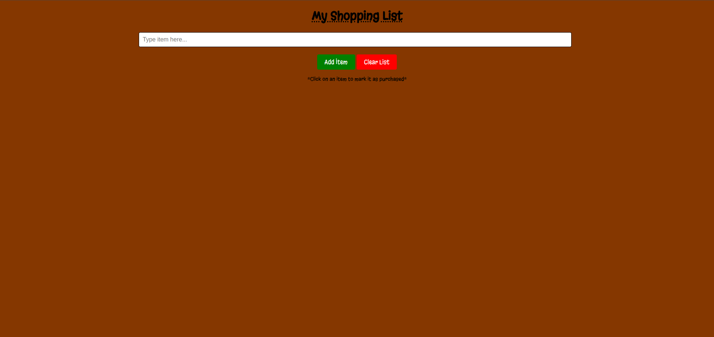
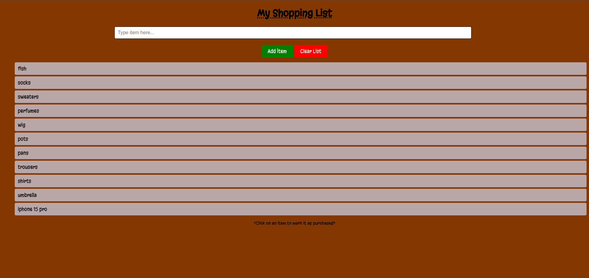
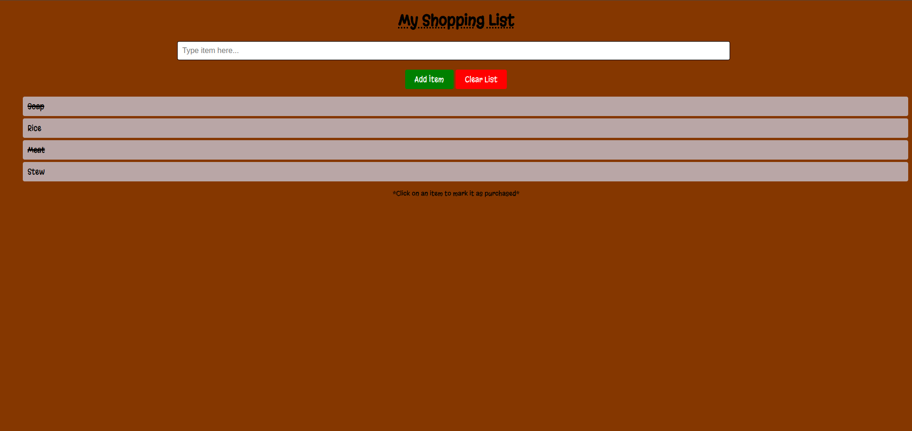

# Phase 1 week 2 Code challange (Interactive Shopping list)

## By Namada Junior

## Project Description

The website is a simple shopping list website that allows users to add items to a list and check them off when they have been purchased. The website is built using HTML, CSS, and JavaScript and uses a simple button to add items to the list and a clear button to remove all items from the list. The website also uses some custom fonts and colors to make it visually appealing.

Here is the link to the website [(https://namadajr.github.io/Phase-1-week-2-codechallange/)](https://namadajr.github.io/Phase-1-week-2-codechallange/)

## Features of the website
This is how the website looks upon being loaded on to the browser.


This is how the website looks after items have been added to the shopping list.


As the user purchases items from the shopping list, they can click on the item to cross it off to show that the item has been bought.



## Properties of the website
### HTML
This is the structure of the Html file which is the foundation of the page.

```html
  <body>
    <h1>My Shopping List</h1>

    <div>
      <input type="text" id="itemInput" placeholder="Type item here..." />
    </div>

    <div>
      <button id="addItem">Add Item</button>
      <button id="clearList">Clear List</button>
    </div>

    <ol id="shoppingList">
      <!-- List items will be added here -->
    </ol>

    <p>*Click on an item to mark it as purchased*</p>

    <script src="./script.js"></script>
  </body>
```
### CSS
This is the styling that was used to make the website more appealing to the user.

```css
@import url("https://fonts.googleapis.com/css2?family=Bilbo+Swash+Caps&family=Ga+Maamli&family=Jacquarda+Bastarda+9+Charted&family=Margarine&family=Playball&family=Playwrite+IS&display=swap");

body {
  background-color: rgb(133, 55, 0);
  text-align: center;
  font-family: "Margarine", sans-serif;
  font-weight: 400;
  font-style: normal;
}

h1 {
  color: black;
  text-decoration: underline dotted;
}

input[type="text"] {
  padding: 10px;
  font-size: 16px;
  width: 60%;
  margin-right: 10px;
  border: 1px solid black;
  border-radius: 4px;
}

#addItem {
  font-family: "Margarine", sans-serif;
  padding: 10px 20px;
  font-size: 16px;
  background-color: green;
  color: white;
  border: none;
  border-radius: 4px;
  cursor: pointer;
}

#clearList {
  font-family: "Margarine", sans-serif;
  margin-top: 20px;
  padding: 10px 20px;
  font-size: 16px;
  background-color: red;
  color: white;
  border: none;
  border-radius: 4px;
  cursor: pointer;
}

ul {
  padding: 0;
}

li {
  padding: 10px;
  margin-bottom: 5px;
  background-color: #b9a6a6;
  border-radius: 4px;
  display: flex;
  justify-content: space-between;
}

li.completed {
  text-decoration: line-through;
}

p {
  font-family: "Margarine", sans-serif;
  font-size: 14px;
  color: black;
}
```

### Javascript

This function first clears the previous list items, then iterates over the shoppingItems array, creating a new list item for each item in the array. If an item is marked as completed, it adds a "completed" class to the list item, it allows toggling the completed status of an item.
```js
function renderItems() {
  const list = document.getElementById("shoppingList");
  list.innerHTML = ""; 

  shoppingItems.forEach((item, index) => {
    const listItem = document.createElement("li");
    listItem.textContent = item.name;

    if (item.completed) {
      listItem.classList.add("completed");
    }

    listItem.addEventListener("click", () => {
      item.completed = !item.completed;
      renderItems(); 
    });

    list.appendChild(listItem);
  });
}
```

This function adds items to the shopping list.
```js
function addItem() {
  const itemInput = document.getElementById("itemInput");
  const itemName = itemInput.value.trim();

  if (itemName !== "") {
    shoppingItems.push({ name: itemName, completed: false });
    renderItems();
    itemInput.value = ""; 
  }
}
```

This function clears all items from the list.
```js
function clearList() {
  shoppingItems = [];
  renderItems(); 
}
```

This are the event listeners that enable the buttons to function.
```js
document.getElementById("addItem").addEventListener("click", addItem);
document.getElementById("clearList").addEventListener("click", clearList);
```
## System Requirements

- Node 18+
- A browser capable of running JavaScript (Chrome, Firefox, Safari, or Edge)
- Operating System (Windows 10+, MacOS, Linux, etc.)
- A text editor capable of running JavaScript (Visual Studio Code, Vim, Nano, Emacs, Atom, Sublime Text, etc.)
- RAM >= 4GB
- Disk space >= 1GB

## Technology used

Used Visual Studio Code editor to write the HTML, CSS and Javascript used to create the website.

HTML - HTML was used to create the structure and foundation of the landing page.

CSS - used css to style the website to look appealing to the user.

Javascript - Used Javascript to create functions and conditions that manipulate items on the webpage.

## Development

Want to contribute? Excellent, To enhance or contribute on the existing project, follow these steps:

- Fork the repo
- Create a new branch (git checkout -b enhance-feature)
- Make the appropriate changes in the files
- Add changes to reflect the changes made
- Commit your changes (git commit -m 'enhanced feature')
- Push to the branch (git push origin enhance-feature)
- Create a Pull Request

## License

MIT License

Copyright (c) [2024] [Namada Junior]

Permission is hereby granted, free of charge, to any person obtaining a copy
of this software and associated documentation files (the "Software"), to deal
in the Software without restriction, including without limitation the rights
to use, copy, modify, merge, publish, distribute, sublicense, and/or sell
copies of the Software, and to permit persons to whom the Software is
furnished to do so, subject to the following conditions:

The above copyright notice and this permission notice shall be included in all
copies or substantial portions of the Software.

THE SOFTWARE IS PROVIDED "AS IS", WITHOUT WARRANTY OF ANY KIND, EXPRESS OR
IMPLIED, INCLUDING BUT NOT LIMITED TO THE WARRANTIES OF MERCHANTABILITY,
FITNESS FOR A PARTICULAR PURPOSE AND NONINFRINGEMENT. IN NO EVENT SHALL THE
AUTHORS OR COPYRIGHT HOLDERS BE LIABLE FOR ANY CLAIM, DAMAGES OR OTHER
LIABILITY, WHETHER IN AN ACTION OF CONTRACT, TORT OR OTHERWISE, ARISING FROM,
OUT OF OR IN CONNECTION WITH THE SOFTWARE OR THE USE OR OTHER DEALINGS IN THE
SOFTWARE.